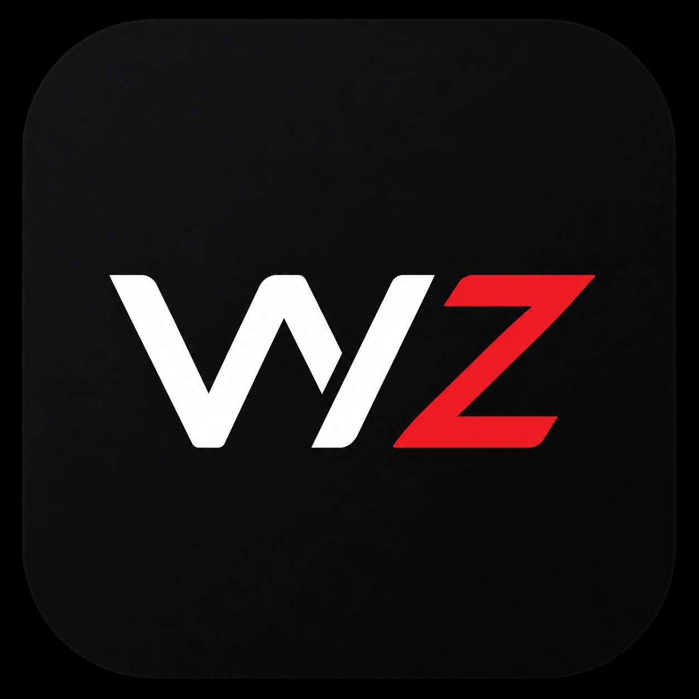

<p align="center">
  
</p>

# WhiteZia Android

Android client for the WhiteZia subscription service.

Current app version: `1.5.7.3` (`versionCode` 19).

Official releases are published only on GitHub:

https://github.com/BigDaddy3334/WhiteZia/releases

The app is not published on Google Play. APKs from other stores or third-party mirrors are not official.

## What The App Does

WhiteZia starts with an AmneziaWG tunnel. If AmneziaWG is unavailable or fails the connection checks, the app falls back to the StormDNS DNS tunnel.

Current connection behavior:

- Wi-Fi: uses AmneziaWG only.
- Mobile network: tries AmneziaWG first.
- Mobile fallback: starts StormDNS only when AmneziaWG is unavailable or fails.
- DNS fallback optimization: scans local resolvers, caches working candidates, and compares them against public fallback resolvers.
- Subscription import: supports direct subscription links and QR-code scanning.
- Logs: connection logs are preserved in order and shown in a scrollable log window.

## Main Features

- AmneziaWG tunnel support through Android `VpnService`.
- StormDNS fallback tunnel with resolver optimization.
- Local resolver scan and cache.
- Built-in fallback resolvers.
- QR scanner for subscription/profile import.
- Subscription link import.
- Visible connection optimization progress.
- Runtime logs, connection state, progress, and traffic statistics.
- Foreground VPN service notifications.
- Quick Settings tile.
- Jetpack Compose UI.

## Project Structure

```text
.
|-- app/
|   |-- build.gradle.kts
|   `-- src/main/
|       |-- AndroidManifest.xml
|       |-- java/shop/whitezia/client/
|       |   |-- MainActivity.kt
|       |   |-- QrScannerActivity.kt
|       |   |-- model/      # settings, subscription links, profile parsing
|       |   |-- proxy/      # local proxy and HTTP bridge
|       |   |-- runtime/    # runtime state, logs, traffic, progress
|       |   |-- scan/       # resolver scan and optimization
|       |   |-- storm/      # StormDNS config and process management
|       |   |-- ui/         # Compose UI and view model
|       |   `-- vpn/        # Android VPN, AmneziaWG and tun2socks
|       |-- jniLibs/        # packaged native binaries
|       `-- res/            # app resources
|-- third_party/
|   `-- StormDNS/
|-- docs/
|-- Makefile
`-- THIRD_PARTY_NOTICES.md
```

## Build

Requirements:

- JDK 17.
- Android SDK with `compileSdk = 36`.
- Android NDK `26.3.11579264`.
- Go matching `third_party/StormDNS/go.mod` if native StormDNS is rebuilt.

Run tests:

```bash
./gradlew testDebugUnitTest
```

Build release APKs:

```bash
./gradlew :app:assembleRelease
```

Build debug APK:

```bash
make debug
```

The debug build uses package `shop.whitezia.client.debug` and app label `WhiteZia Debug`, so it can be installed next to the release app.

## Releases And Signing

The latest GitHub release is `v1.5.7.3`.

Release APKs are built from the Android `release` build type with minify and resource shrink enabled.

Current manually attached APKs are signed with the local Android debug certificate because a production release keystore has not been configured yet. Before public distribution, configure a stable production keystore and keep it backed up; otherwise users may not be able to update from one release to the next.

## Third-Party Components

WhiteZia uses:

- StormDNS, based on the MasterDNS client lineage.
- AmneziaWG userspace/native components.
- `tun2socks` for VPN traffic handling.
- ZXing and CameraX for QR scanning.

See [THIRD_PARTY_NOTICES.md](./THIRD_PARTY_NOTICES.md) for third-party license details.
