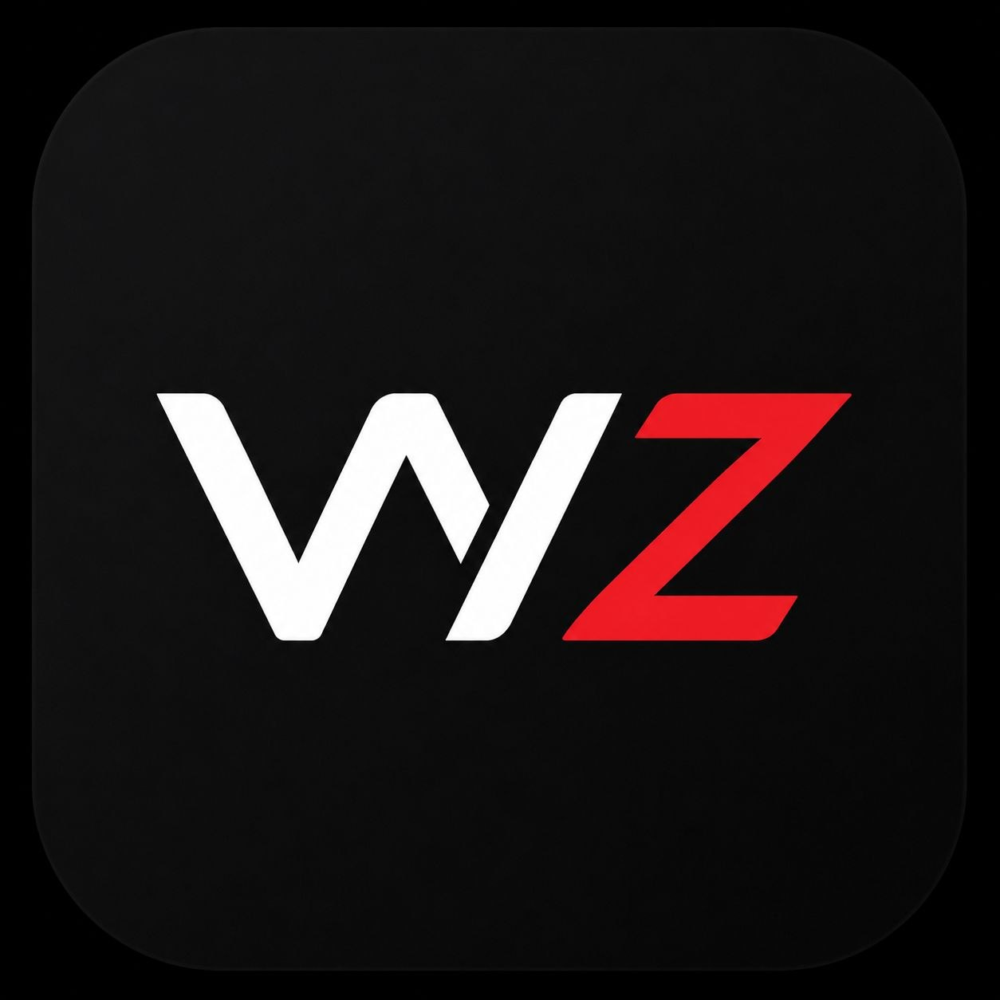

<p align="center">
  
</p>

# WhiteZia Android

Android client for the WhiteZia subscription service.

Current app version: `1.5.7.9` (`versionCode` 25).

Official production builds are distributed through the WhiteZia Telegram bot and
the in-app updater. Source code and release notes are published on GitHub:

https://github.com/BigDaddy3334/WhiteZia

The app is not published on Google Play. APKs from other stores or third-party
mirrors are not official.

Telegram bot for subscriptions and app downloads: [@whitezia](https://t.me/whitezia)

## What The App Does

WhiteZia starts with an AmneziaWG tunnel. In automatic mode the fallback chain
is AmneziaWG -> Xray -> StormDNS.

Current connection behavior:

- AmneziaWG is always attempted first.
- On a mobile network, an unsuccessful AmneziaWG connection can fall back to
  VLESS/Xray after the previous tunnel has stopped and the Xray tunnel passes
  its health check.
- Xray is not started over Wi-Fi. On Wi-Fi, a failed AmneziaWG connection can
  continue directly to the StormDNS fallback.
- StormDNS is the final fallback and selects a resolver after local and public
  candidates are compared.
- DNS fallback optimization: scans local resolvers, caches working candidates, and compares them against public fallback resolvers.
- Subscription import: supports `stormbundle://` links with AmneziaWG, VLESS,
  and StormDNS data, plus QR-code scanning.
- Logs: connection logs are preserved in order and shown in a scrollable log window.

## Main Features

- AmneziaWG tunnel support through Android `VpnService`.
- VLESS/Xray xHTTP fallback through a local SOCKS bridge and Android VPN tunnel.
- StormDNS fallback tunnel with resolver optimization.
- Local resolver scan and cache.
- Built-in fallback resolvers.
- QR scanner for subscription/profile import.
- Subscription link import.
- Visible connection optimization progress.
- Runtime logs, connection state, progress, and traffic statistics.
- Foreground VPN service notifications.
- Quick Settings tile.
- Jetpack Compose UI.

## Project Structure

```text
.
|-- app/
|   |-- build.gradle.kts
|   `-- src/main/
|       |-- AndroidManifest.xml
|       |-- java/shop/whitezia/client/
|       |   |-- MainActivity.kt
|       |   |-- QrScannerActivity.kt
|       |   |-- model/      # settings, subscription links, profile parsing
|       |   |-- fallback/   # automatic transport selection and health checks
|       |   |-- proxy/      # local proxy and HTTP bridge
|       |   |-- runtime/    # runtime state, logs, traffic, progress
|       |   |-- scan/       # resolver scan and optimization
|       |   |-- storm/      # StormDNS config and process management
|       |   |-- ui/         # Compose UI and view model
|       |   |-- vpn/        # Android VPN, AmneziaWG and tun2socks
|       |   |-- xray/       # VLESS/Xray runtime and configuration
|       |   `-- update/     # signed production update client
|       |-- jniLibs/        # packaged native binaries
|       `-- res/            # app resources
|-- third_party/
|   `-- StormDNS/
|-- docs/
|-- Makefile
`-- THIRD_PARTY_NOTICES.md
```

## Build

Requirements:

- JDK 17.
- Android SDK with `compileSdk = 36`.
- Android NDK `26.3.11579264`.
- Go matching `third_party/StormDNS/go.mod` if native StormDNS is rebuilt.

Run tests:

```bash
./gradlew testDebugUnitTest
```

Build a signed release APK:

```bash
WHITEZIA_RELEASE_PROPERTIES=/secure/path/release.properties \
  ./gradlew :app:assembleRelease
```

Build debug APK:

```bash
make debug
```

The debug build uses package `shop.whitezia.client.debug` and app label `WhiteZia Debug`, so it can be installed next to the release app.

## Releases And Signing

The current production build is `v1.5.8.0` (`versionCode` 26).

Release APKs are built from the Android `release` build type with minify and resource shrink enabled.

Production APKs are signed by a dedicated release key held outside this
repository. The release build fails when signing is not configured. Keep an
encrypted off-host backup of the keystore and its properties file: losing the
key prevents future in-place Android updates.

The production updater accepts only a versioned HTTPS APK whose package ID,
version, size, SHA-256 digest, and signing certificate match the release
metadata. Debug builds use `shop.whitezia.client.debug` and do not query the
production update channel.

Publish a production release with:

```bash
WHITEZIA_CORE_SSH=root@core-host \
WHITEZIA_RELEASE_PROPERTIES=/secure/path/release.properties \
  scripts/publish-production-android.sh 26 1.5.8.0 release-notes/1.5.8.0.md
```

The bot currently distributes the arm64-v8a APK.

## Third-Party Components

WhiteZia uses:

- StormDNS, based on the MasterDNS client lineage.
- AmneziaWG userspace/native components.
- Xray core for VLESS/xHTTP fallback.
- `tun2socks` for VPN traffic handling.
- ZXing and CameraX for QR scanning.

See [THIRD_PARTY_NOTICES.md](./THIRD_PARTY_NOTICES.md) for third-party license details.
