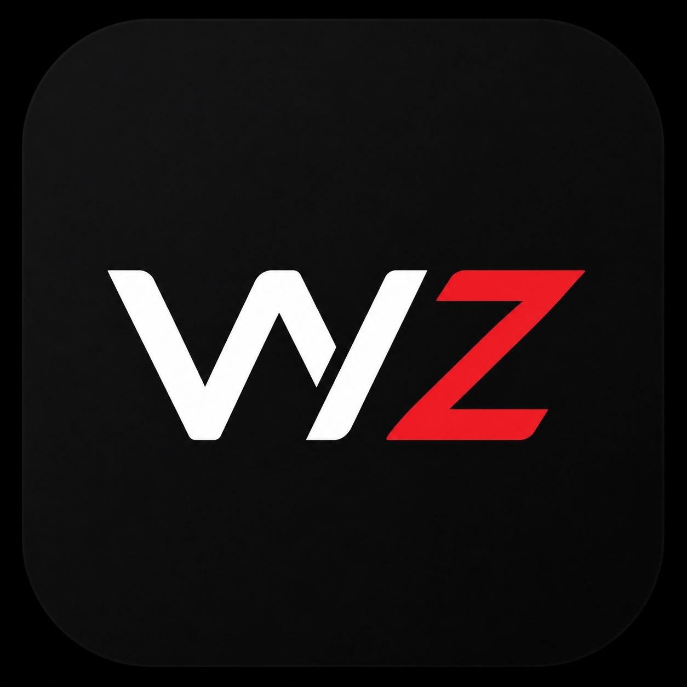

<p align="center">
  
</p>

# WhiteZia Android

Android client for the WhiteZia subscription service.

Current app version: `1.5.8.9` (`versionCode` 36).

Official production builds are distributed through the
[WhiteZia website](https://whitezia.su), the Telegram bot, the in-app updater,
and GitHub Releases. Public APKs are universal ARM builds
for `arm64-v8a` and `armeabi-v7a`.
Source code and release notes are published on GitHub:

https://github.com/BigDaddy3334/WhiteZia

The app is not published on Google Play. APKs from other stores or third-party
mirrors are not official.

Telegram backup channel for email accounts, subscription management,
iOS configurations, and app downloads: [@WhiteZia_bot](https://t.me/WhiteZia_bot)

## What The App Does

The app includes an email-based personal account. It stores the rotating refresh
session with Android Keystore, shows the subscription, devices, tariffs, and
payments, and opens Platega checkout in a Custom Tab. The current installation
enrolls into one of the account's device slots; when provisioning finishes, the
app downloads its device-specific bundle and applies it without exposing the raw
profile in the UI.

Telegram remains a backup channel for email registration and login, payments,
iOS configurations, and app downloads. Android profiles are enrolled and
applied inside the app and are not shown by the bot. When a legacy
Telegram-only user registers or signs in by email through the bot, the existing
subscription is attached automatically when the accounts can be merged safely;
conflicting accounts require support-assisted migration.

Automatic mode uses the following ordered chain when the subscription contains
the corresponding profiles: direct Xray -> CDN Xray -> StormDNS. AmneziaWG
issuance is currently suspended, including iOS; legacy import support remains.

Managed bundles can contain primary and standby candidates for each transport.
Before starting a VPN, the app probes all Xray routes with bounded TCP/TLS
checks. Reachable direct routes always take priority over CDN routes, even when
a CDN responds faster. Latency orders candidates within each route group.
StormDNS is used only after Xray routes fail. Core excludes nodes
marked down or draining, prefers healthy nodes, and balances new or re-enrolled
devices by configured capacity and current assignment load.

Current connection behavior:

- Automatic mode tries reachable direct Xray routes first, then CDN routes.
  Manual mode can instead start only
  Xray or force the StormDNS channel.
- Before each connection or mode change, the app stops the previous tunnel
  and waits for its shutdown before probing and starting another route.
- Xray is attempted when the bundle has a VLESS/Xray profile and an underlying
  Wi-Fi or cellular network is available. It must
  pass the Xray health check before the app reports a successful connection.
- StormDNS is the final automatic fallback, and forced-DNS mode starts it
  directly. Only StormDNS waits until Wi-Fi is inactive.
- With no reachable Xray profile, automatic mode proceeds to StormDNS
  once Wi-Fi is off. Endpoint reachability does not replace the tunnel health check.
- For built-in and local resolver sets, the app benchmarks candidates on the
  first DNS fallback and again at the next DNS fallback after every 10 app
  launches. It reuses the cached winner between benchmarks. When custom
  resolvers are enabled, their entries are used as entered and never cached.
- Subscription import: supports `stormbundle://` links with AmneziaWG, VLESS,
  and StormDNS data, legacy `stormdns://` profiles, and QR-code scanning.
- Logs: connection logs are preserved in order and shown in a scrollable log window.
- The VPN service reconnects the active transport when the underlying network
  changes, including while the app is in the background.
- Split tunneling is accessible from the main screen. System settings include
  a persistent light-theme switch.

## Main Features

- Legacy AmneziaWG profile import; AWG is not started by the current planner.
- Direct and CDN VLESS/Xray XHTTP routes for automatic and Xray-only modes.
- StormDNS tunnel for the final fallback and forced DNS mode.
- Resolver scan, cached winners, and periodic local-versus-Yandex benchmarks.
- Built-in fallback resolvers.
- QR scanner for subscription/profile import.
- Subscription link import.
- Email registration, verification, password recovery, account dashboard, device enrollment, and in-app payment flow.
- Visible connection optimization progress.
- Runtime logs, connection state, progress, and traffic statistics.
- Foreground VPN service notifications.
- Quick Settings tile.
- Jetpack Compose UI.

## Project Structure

```text
.
|-- app/
|   |-- build.gradle.kts
|   `-- src/main/
|       |-- AndroidManifest.xml
|       |-- java/shop/whitezia/client/
|       |   |-- MainActivity.kt
|       |   |-- QrScannerActivity.kt
|       |   |-- model/      # settings, subscription links, profile parsing
|       |   |-- account/    # email auth, Keystore session, billing and device enrollment
|       |   |-- fallback/   # automatic transport selection and health checks
|       |   |-- proxy/      # local proxy and HTTP bridge
|       |   |-- resolver/   # resolver benchmark policy and scheduling
|       |   |-- runtime/    # runtime state, logs, traffic, progress
|       |   |-- scan/       # resolver scan and optimization
|       |   |-- storm/      # StormDNS config and process management
|       |   |-- ui/         # Compose UI, view model, connect and settings screens
|       |   |-- vpn/        # Android VPN, AmneziaWG and tun2proxy
|       |   |-- xray/       # VLESS/Xray runtime and configuration
|       |   |-- controlplane/ # restricted bootstrap transport for API access
|       |   `-- update/     # verified production updater
|       |-- jniLibs/        # packaged native binaries
|       `-- res/            # app resources
|-- bootstrap.properties.example
|-- release-notes/
|-- third_party/            # fonts and their license files
|-- docs/
|-- scripts/
|-- Makefile
`-- THIRD_PARTY_NOTICES.md
```

## Build

Requirements:

- JDK 17.
- Android SDK with `compileSdk = 36`.
- Android NDK `26.3.11579264`.

The repository already contains the native runtimes used by normal Gradle
builds. The optional StormDNS targets in `Makefile` are maintainer tooling and
require a separate StormDNS source checkout at `third_party/StormDNS`, Go, and
NDK `29.0.14206865`.

The packaged ARM runtimes use Xray `26.7.28`. ARM64 uses the official
`Xray-android-arm64-v8a.zip` release asset; ARMv7 is built from the same upstream
commit using Go `1.26.5` and Android NDK `26.3.11579264` (API 26):

```bash
XRAY_SOURCE=/path/to/Xray-core \
ANDROID_NDK_HOME=/path/to/android-ndk \
GO_BINARY=/path/to/go1.26.5/bin/go \
  bash scripts/build-xray-android.sh armeabi-v7a
```

Check out tag `v26.7.28` before running the script. The output goes to
`build/xray/armeabi-v7a/libxray.so`; copy it into the corresponding `jniLibs`
directory after verification. Runtime provenance and checksums are recorded in
`app/src/main/jniLibs/xray-build-info.json`.

Run tests:

```bash
./gradlew testDebugUnitTest
```

Build a signed release APK:

```bash
WHITEZIA_RELEASE_PROPERTIES=/secure/path/release.properties \
WHITEZIA_BOOTSTRAP_PROPERTIES=/secure/path/bootstrap.properties \
  ./gradlew :app:assembleRelease
```

`bootstrap.properties` contains a restricted VLESS URI used only when the
account and update API cannot be reached directly. The corresponding server
credential must be limited to WhiteZia control-plane domains and must not
provide general internet access. See `bootstrap.properties.example`.

When the primary Core remains unavailable, a signed-in installation can use the
read-only recovery API at `https://whitezia.su/api/recovery/device-bundle`. The
client first requests a short-lived challenge using its installation identity
and refresh token, which the app stores encrypted with an Android Keystore key.
It then signs the challenge with its Keystore-backed device key and submits the
proof. Recovery can only restore the current `stormbundle` for that device; it
cannot log in, take payments, enroll devices, or change subscription state.

Before a user-initiated connection, a signed-in installation refreshes its
managed device bundle. If neither Core route is reachable, the refresh is
cancelled or ignored and the last validated local profile remains usable. A
manually imported static profile is used locally without this managed refresh.
Fallback transitions within the same connection attempt do not repeat the API
request.

Account traffic uses `https://api.whitezia.ru/api` as the primary endpoint.
Operations explicitly marked replayable can retry through
`https://whitezia.su/api`; non-replayable writes remain pinned to the primary
Core. Signed device recovery and release endpoints remain available through the
reserve frontend.

Build debug APK:

```bash
./gradlew :app:assembleDebug
```

The debug build uses package `shop.whitezia.client.debug` and app label `WhiteZia Debug`, so it can be installed next to the release app.

## Releases And Signing

The current production build is `v1.5.8.9` (`versionCode` 36).

Release APKs are built from the Android `release` build type with minify and resource shrink enabled.

Production APKs are signed by a dedicated release key held outside this
repository. The release build fails when signing is not configured. Keep an
encrypted off-host backup of the keystore and its properties file: losing the
key prevents future in-place Android updates.

The production updater accepts only an HTTPS APK whose package ID,
version, size, SHA-256 digest, and signing certificate match the release
metadata. Debug builds use `shop.whitezia.client.debug` and do not query the
production update channel.

Build, verify, and publish to the primary Core OTA and Telegram bot with:

```bash
WHITEZIA_CORE_SSH=root@core-host \
WHITEZIA_RELEASE_PROPERTIES=/secure/path/release.properties \
WHITEZIA_BOOTSTRAP_PROPERTIES=/secure/path/bootstrap.properties \
  scripts/publish-production-android.sh 36 1.5.8.9 release-notes/1.5.8.9.txt
```

The script verifies the universal APK, copies it to the primary Core, updates the
Core and bot release metadata, restarts Core, and verifies the primary OTA
endpoint. It does not upload a GitHub Release or update the reserve
`whitezia.su` OTA endpoint; those production channels must be published
separately.

All production channels must publish the same universal ARM APK containing both
`arm64-v8a` and `armeabi-v7a` native runtimes.

## Third-Party Components

WhiteZia uses:

- StormDNS, based on the MasterDNS client lineage.
- AmneziaWG userspace/native components.
- Xray core for VLESS/XHTTP fallback.
- `tun2proxy` for VPN traffic handling.
- ZXing and CameraX for QR scanning.

See [THIRD_PARTY_NOTICES.md](./THIRD_PARTY_NOTICES.md) for third-party license details.
